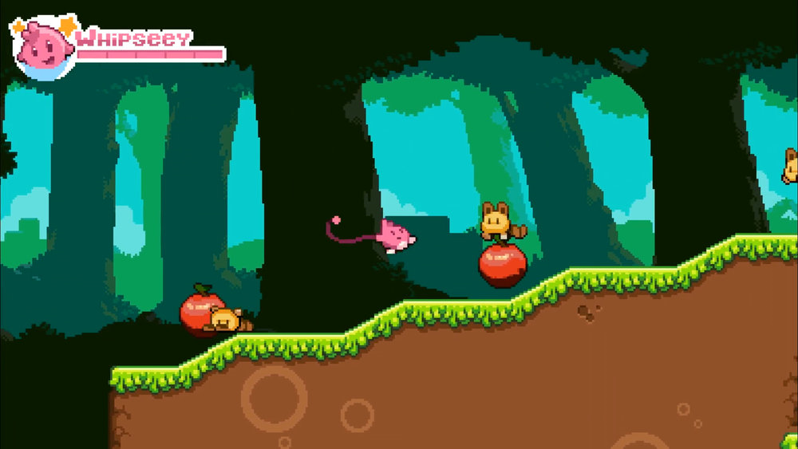
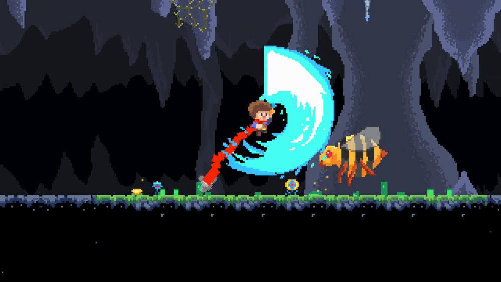
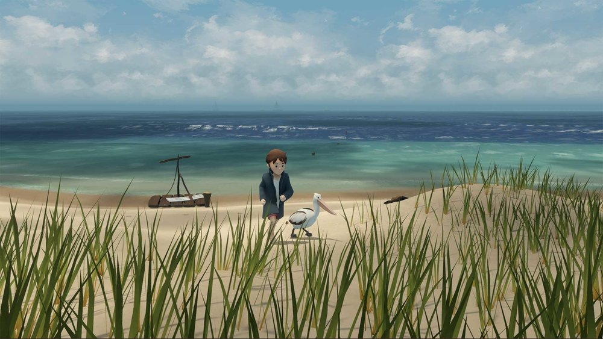

<h1><strong>About Me</strong></h1>

Game development and software programming are my passions. With over five years of study and two years of professional experience in these fields, I am well-equipped to take on any challenges that are thrown my way.

Flexibility and adaptability are my greatest strengths, and I have previous experience in many languages, engines and technologies - especially Unity, C# and C++. I'm happiest when working on the engines and tools used to create amazing interactive experiences.

 

<h1><strong>Whipseey and the Lost Atlas</strong> - GameMaker Studio 2</h1>

<strong>View the game description on the <a href="https://www.blowfishstudios.com/game/whipseey">Blowfish Studios</a> website!</strong>

After discovering a magical book, a young boy named Alex is whisked away to Whipseeyland, where he transforms into Whipseey, the pink, whip-wielding hero of this bright, colorful world. With the help of Princess Alyssa, Whipseey embarks on a quest to recover magical orbs that possess the power to return him home.

Inspired by classic 2D platformers, *Whipseey and the Lost Atlas* is a challenging throwback to a golden age filled with picturesque levels, a relaxing soundtrack, and memorable boss fights.

*Whipseey and the Lost Atlas* was created in GameMaker Studio 2 by Daniel A. Ramirez and published for Steam, Playstation 4, Xbox One and Switch by [Blowfish Studios](https://www.blowfishstudios.com/).

 

<h1><strong>JackQuest</strong> - GameMaker Studio 2</h1>

<strong>View the game description on the <a href="https://www.blowfishstudios.com/game/jack-quest">Blowfish Studios</a> website!</strong>

One fateful night, when young Jack takes the beautiful Nara for a walk in the woods, his love is kidnapped by the villainous orc Korg. Forced to mount a rescue, Jack plunges into Korg’s underground base, where he happens upon a strange blade that becomes an unlikely ally.

In *JackQuest*, players will explore the cavernous depths of Korg’s slime-ridden, labyrinthine lair. There, they will solve environmental puzzles, discover power-ups, obtain new abilities, collect weapons, and challenge subterranean foes, including massive bosses.

*JackQuest* was created in GameMaker Studio 2 by [NX Games](http://nx-games.com/) and published for Playstation 4, Xbox One and Switch by [Blowfish Studios](https://www.blowfishstudios.com/).

 

<h1><strong>Storm Boy: The Game</strong> - Unity/C#</h1>

<strong>View the game description on the <a href="https://www.blowfishstudios.com/game/storm-boy">Blowfish Studios</a> website!</strong>

Based on Colin Thiele's 1964 children’s book of the same name, *Storm Boy* takes place on the beaches of South Australia near the mouth of the Murray River, where the titular protagonist rescues orphaned pelican chicks, one of whom later becomes the child’s pet and faithful companion, Mr. Percival.

Experience an interactive retelling of the classic tale by taking control of both Storm Boy and Mr. Percival in key moments, such as when the pair rescued stranded sailors during a storm. Relive their friendship and enjoy seaside activities across a wide assortment of fun and relaxing mini-games, including sand drawing, sailing, cockle hunting, playing fetch, sand surfing, pelican feeding, and more.

*Storm Boy* was created in Unity and published for PC, Mac, Playstation 4, Xbox One, Switch, Android, iOS and Apple TV by [Blowfish Studios](https://www.blowfishstudios.com/).

 

<h1><strong>Face Up To (Virtual) Reality</strong> - Unity/C#/VR</h1>

<strong>View the repo on <a href="https://github.com/DavidCagnacci/face-up-to-virtual-reality">GitHub</a></strong>

*Face Up To (Virtual) Reality* is a VR research tool, developed independently for a PhD candidate at the University of Newcastle.

*Face Up To (Virtual) Reality* features:
- Virtual reality display and head-tracking
- File output of positional data and user input

 

<h1><strong>Foraging Through</strong> - Unity/C#</h1>

<strong>View sample scripts on <a href="https://github.com/DavidCagnacci/foraging-through-samples">GitHub</a></strong>

<strong>Demo a playable PC build <a href="assets/files/ForagingThrough.zip">here</a>!</strong>

*Foraging Through* is a small mobile game in which the player controls a hungry squirrel, collecting food from their environment to survive for as many years as possible. *Foraging Through* was created in collaboration with a group of fellow students for a major project at the Academy of Interactive Entertainment.

*Foraging Through* features:
- Utilisation of Unity's NavMesh and NavMeshAgent features
- Customised shaders for advanced visual effects
- Optimisation for mobile hardware

<iframe width="560" height="315" src="https://www.youtube.com/embed/PmNQuy2XeQc" frameborder="0" gesture="media" allow="encrypted-media" allowfullscreen></iframe>

 

<h1><strong>Goal-Oriented Action Planning AI</strong> - Unity/C#</h1>

<strong>View and download the repository on <a href="https://github.com/DavidCagnacci/goap-ai">GitHub</a></strong>

This *goal-oriented action planner (GOAP) AI* system can devise a plan to reach a specified "goal" state using a predetermined list of "actions" supplied to it.

The *GOAP AI* features:
- A* pathfinding with dynamic node validation
- Variable preconditions and effects
- Generic design promoting high reusability

The example shown in the video below features a basic RTS game, where the AI devises an action plan to create the specified number of "fighter" units. Sprites created by [Kenney.nl](https://kenney.nl/).

<iframe width="560" height="315" src="https://www.youtube.com/embed/RAAv_Z6vYyY" frameborder="0" gesture="media" allowfullscreen></iframe>

 

<h1><strong>Wheel Words</strong> - HTML5/TypeScript</h1>

<strong><a href="https://lovattspuzzles.com/online-puzzles-competitions/wheel-words/">Play it now!</a></strong>

*Wheel Words* is a word puzzle game, challenging the player to find as many words as possible using the provided letters - all words found must include the centre letter. *Wheel Words* was developed using HTML5, AngularJS and TypeScript for [Lovatts Media Group](https://www.lovattsmedia.com/), and can be played online [here](https://lovattspuzzles.com/online-puzzles-competitions/wheel-words/).

*Wheel Words* features:
- Responsive web design
- Server-provided content
- GSAP-driven animations

