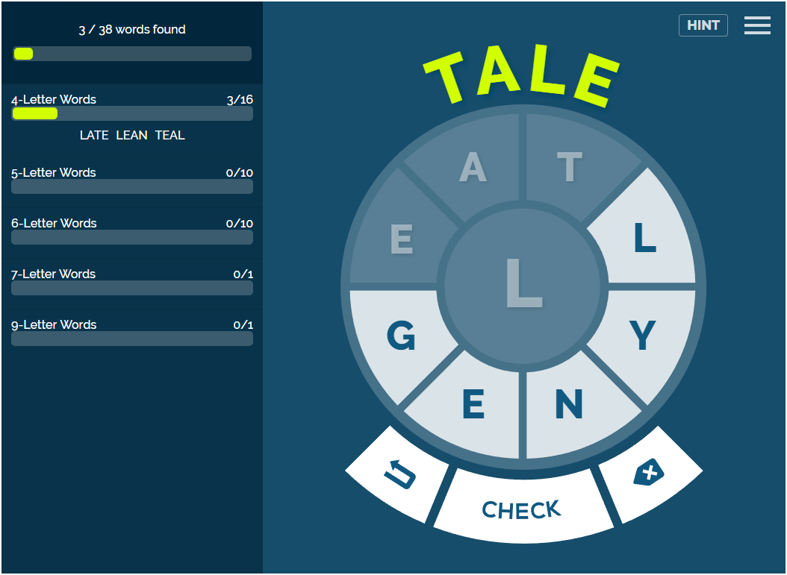

<h1><strong>About Me</strong></h1>

Game development and software programming are my passions. With over five years of study in these fields, I am well-equipped to take on any challenges that are thrown my way.

Flexibility and adaptability are my greatest strengths, while my previous experience mostly resides in C++, C# and Unity. I greatly enjoy working with artificial intelligence, shaders and procedural generation due to the virtually unlimited possibilities these technologies make possible.

 

<h1><strong>Wheel Words</strong> - HTML5/TypeScript</h1>

<strong><a href="https://lovattspuzzles.com/online-puzzles-competitions/wheel-words/">Play it now!</a></strong>

*Wheel Words* is a word puzzle game, challenging the player to find as many words as possible using the provided letters - all words found must include the centre letter. *Wheel Words* was developed using HTML5, AngularJS and TypeScript for [Lovatts Media Group](https://www.lovattsmedia.com/), and can be played online [here](https://lovattspuzzles.com/online-puzzles-competitions/wheel-words/).

*Wheel Words* features:
- Responsive web design
- Server-provided content
- GSAP-driven animations

 

<h1><strong>Foraging Through</strong> - Unity/C#</h1>

<strong>View sample scripts on <a href="https://github.com/DavidCagnacci">GitHub</a></strong>

*Foraging Through* is a small mobile game in which the player controls a hungry squirrel, collecting food from their environment to survive for as many years as possible. *Foraging Through* was created in collaboration with a group of fellow students for a major project at the Academy of Interactive Entertainment.

*Foraging Through* features:
- Utilization of Unity's AI features (e.g. NavMeshes)
- Custom-written shaders for advanced visual effects
- Optimization for mobile hardware

<iframe width="560" height="315" src="https://www.youtube.com/embed/PmNQuy2XeQc" frameborder="0" gesture="media" allow="encrypted-media" allowfullscreen></iframe>

 

<h1><strong>Goal-Oriented Action Planning AI</strong> - Unity/C#</h1>

<strong>View the repository on <a href="https://github.com/DavidCagnacci">GitHub</a></strong>

This *goal-oriented action planner (GOAP) AI* system can devise a plan to reach a specified "goal" state using a predetermined list of "actions" supplied to it. The *GOAP AI* was developed for an project at the Academy of Interactive Entertainment. Sprites created by [Kenney.nl](https://kenney.nl/).

The *GOAP AI* features:
- A* pathfinding with dynamic node validation
- Variable preconditions and effects
- Generic design promoting high reusability

The example shown in the video below features a basic RTS game, where the AI devises an action plan to create the specified number of "fighter" units.

<iframe width="560" height="315" src="https://www.youtube.com/embed/RAAv_Z6vYyY" frameborder="0" gesture="media" allowfullscreen></iframe>

